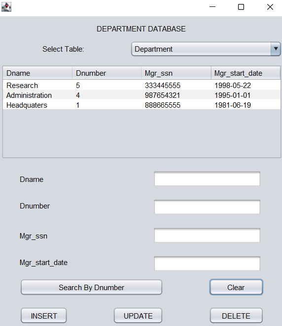
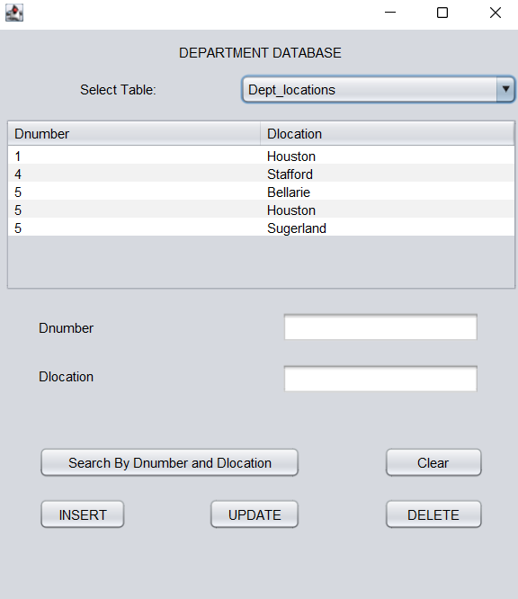

# JDBC-CRUD-Ops
JDBC-CRUD-Ops is a Java Application to demonstrate JDBC CRUD operations. 

    
    

Features
- User can create, read, update, and delete records in the tables.
- They can search records.

You wil need these things to build this project,
- a JAVA IDE
- Java Swing
- MY SQL
- A local server software
